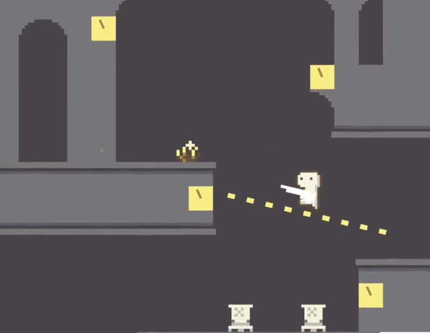
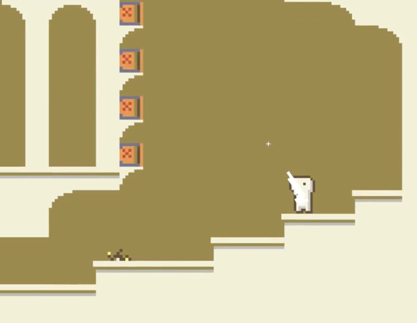

### 「タイム・オブ・ルイン」 ーー 時間停止の世界で進めよう！

* アクションパズルゲーム
* ゲームエンジン：Unity
* 個人製作
* 製作時間：3週間

### プレイ動画
https://github.com/user-attachments/assets/9658919e-d825-4557-9aec-30e0567cac51

### 特徴
「時間停止」を基にした様々なパズル

### 利用素材
* BGM・効果音　魔王魂
* キャラクター動画参考　[@ScissorMarks](https://arks.itch.io/dino-characters)
